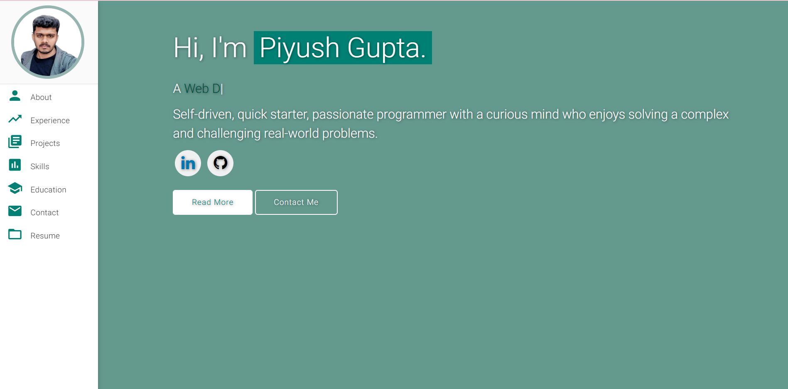

# Personal Portfolio ⚡️ 
> A clean, beautiful, responsive portfolio template for Software Developers!

> https://github.com/Piyush-t24

 

### Website Preview

 
  <kbd>
    
  </kbd>

:star: Star me on GitHub — it helps!

## Features 📋
⚡️ Fully Responsive\
⚡️ Valid HTML5 & CSS3\
⚡️ Typing animation using `Typed.js`\
⚡️ Easy to modify

## Sections 📚
✔️ About me\
✔️ Experience\
✔️ Projects \
✔️ Skills \
✔️ Education\
✔️ Contact Info\
✔️ Resume

To view a live example, **[click here]https://www.piyushgupta.me/)**

